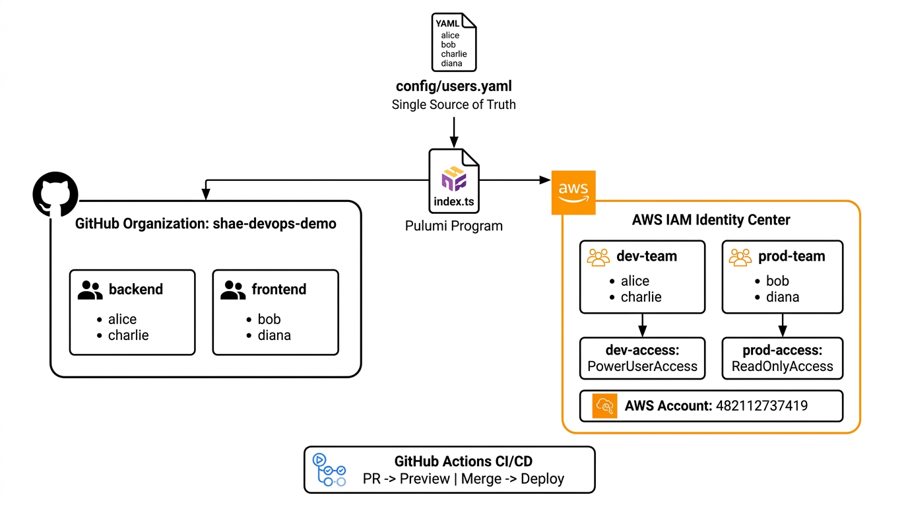

# infra-user-management

Pulumi (TypeScript) infrastructure-as-code that manages **GitHub organization users/teams** and **AWS IAM Identity Center (SSO) users/groups** from a single configuration file.

## Architecture



### Key design decisions

| Decision | Rationale |
|---|---|
| **TypeScript** | Strong typing, first-class Pulumi support, better IDE experience |
| **ComponentResource classes** | Encapsulate related resources; reusable across stacks |
| **Separate YAML config** | Non-engineers can edit users without touching IaC code |
| **Least-privilege permission sets** | `dev` -> PowerUserAccess; `prod` -> ReadOnlyAccess |
| **Pulumi stacks for multi-env** | `dev` and `prod` stacks with independent configs |
| **Pulumi-native secret management** | Secrets encrypted in state; no external vault required |

## Prerequisites

| Tool | Version |
|---|---|
| [Node.js](https://nodejs.org/) | >= 18 |
| [Pulumi CLI](https://www.pulumi.com/docs/install/) | >= 3.x |
| AWS account with IAM Identity Center enabled | - |
| GitHub organization | - |

## Quick start

```bash
# 1. Clone and install
git clone https://github.com/shae-devops-demo/infra-user-management.git
cd infra-user-management
npm install

# 2. Authenticate
export PULUMI_ACCESS_TOKEN="<your-pulumi-token>"
export AWS_ACCESS_KEY_ID="<your-aws-key>"
export AWS_SECRET_ACCESS_KEY="<your-aws-secret>"
export AWS_REGION="us-east-2"

# 3. Configure the GitHub provider
pulumi config set --secret github:token "<your-github-pat>" --stack dev

# 4. Select a stack and deploy
pulumi stack select dev
pulumi preview   # dry-run
pulumi up        # apply
```

## Configuration

### User config - `config/users.yaml`

All users are defined in a single YAML file:

```yaml
users:
  - name: alice
    email: alice@shae-devops.com
    github_team: backend
    aws_account: dev

  - name: bob
    email: bob@shae-devops.com
    github_team: frontend
    aws_account: prod
```

| Field | Required | Description |
|---|---|---|
| `name` | yes | Username for GitHub membership and AWS SSO |
| `email` | no | Email for the SSO user (defaults to `<name>@example.com`) |
| `github_team` | yes | GitHub team to assign the user to |
| `aws_account` | yes | AWS Identity Center group (maps to a permission set) |

### Stack config - `Pulumi.<stack>.yaml`

| Key | Description |
|---|---|
| `aws:region` | AWS region where Identity Center is enabled |
| `infra-user-management:githubOrg` | GitHub organization slug |
| `infra-user-management:awsAccountId` | AWS account ID for SSO account assignments |

### Secrets

Sensitive values are stored via Pulumi's built-in secret management:

```bash
pulumi config set --secret github:token "ghp_..."   --stack dev
```

In CI, secrets are injected as environment variables (see `.github/workflows/deploy.yml`).

## Multi-environment support

This project uses **Pulumi stacks** for environment isolation:

```bash
pulumi stack init dev
pulumi stack init prod
```

Each stack has its own `Pulumi.<stack>.yaml` with environment-specific values. Deploy to a specific environment by selecting its stack:

```bash
pulumi stack select prod
pulumi up
```

## Tests

```bash
npm test
```

Tests use Pulumi's runtime mocking to validate component behavior without requiring cloud credentials:

- Config loader validation (schema enforcement, error handling)
- GitHubManager creates correct teams and memberships
- AwsIdentityCenterManager creates correct users, groups, and permission sets

## CI / CD

GitHub Actions workflow (`.github/workflows/deploy.yml`):

| Trigger | Action |
|---|---|
| Pull request -> `main` | `pulumi preview` with PR comment |
| Push -> `main` | `pulumi up` (auto-deploy) |

### Required GitHub Actions secrets

| Secret | Value |
|---|---|
| `PULUMI_ACCESS_TOKEN` | Pulumi personal access token |
| `AWS_ACCESS_KEY_ID` | IAM user access key |
| `AWS_SECRET_ACCESS_KEY` | IAM user secret key |
| `GH_PAT` | GitHub PAT with `admin:org` scope |

## Project structure

```
.github/workflows/deploy.yml       CI/CD pipeline
components/
  github-manager.ts                GitHub ComponentResource
  aws-identity-center-manager.ts   AWS SSO ComponentResource
config/
  users.yaml                       User definitions (single source of truth)
tests/
  index.test.ts                    Unit tests with Pulumi mocks
types/
  index.ts                         Shared TypeScript interfaces
utils/
  config-loader.ts                 YAML config parser with validation
index.ts                           Pulumi program entry-point
Pulumi.yaml                        Project metadata
Pulumi.dev.yaml                    Dev stack config
Pulumi.prod.yaml                   Prod stack config
package.json                       Dependencies
tsconfig.json                      TypeScript compiler config
README.md
```

## Teardown

```bash
pulumi destroy --yes   # removes only Pulumi-managed resources
pulumi stack rm dev    # removes the stack from Pulumi Cloud
```
